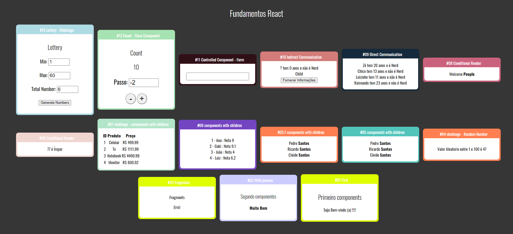

# Fundamentos-React

<h2>Learning and coding about the main concepts of React.js</h2>

This project is used: <strong>Components</strong>, <strong>components with props</strong>, <strong>fragments</strong>, <strong>components with children</strong>, <strong>conditional render</strong>, <strong>direct communication</strong>, <strong>indirect communication</strong>, <strong>controlled component</strong> and <strong>class components.</strong> 

<strong>To run</strong> is need to clone this project with <strong>git clone</strong> and in the root run <strong>npm install</strong> and <strong>npm start</strong> 

<h2>The screen of the project:</h2>

<h2>Other projects about React:</h2>

Fundamentus React - https://github.com/LuSrodri/Fundamentos-React

React Router - https://github.com/LuSrodri/react-router-learning

React Hooks - https://github.com/LuSrodri/React-hooks-learning
